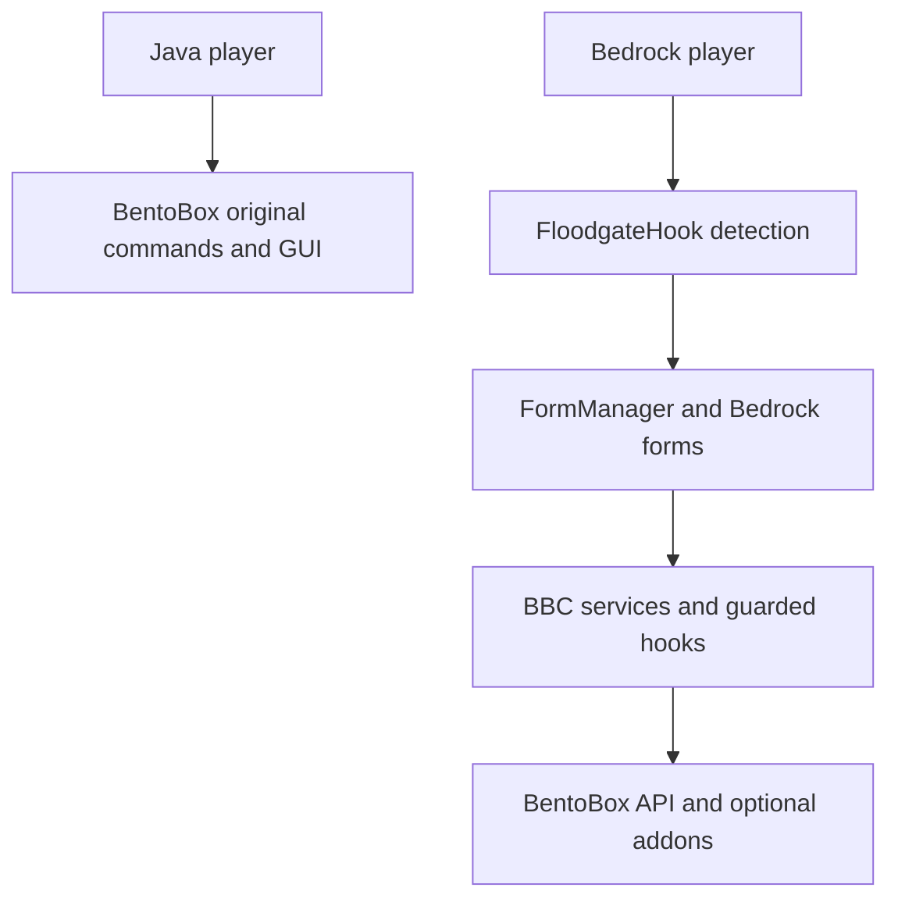

# BentoBox Bedrock Companion Architecture

## Objective

Provide Bedrock Edition players with native Bedrock Forms while keeping the Java Edition experience unchanged.

## Player Flow

## Modules

### Core
Plugin startup and dependency management.

### FloodgateHook
Detect Bedrock players.

### FormManager
Create and manage Bedrock Forms.

### BentoBoxService
Resolve game modes, worlds, islands, and BentoBox data. Cross-game-mode form
requests carry the selected world instead of inferring it from player location.

### SettingsAccess
Mirror BentoBox's command, per-flag, `CHANGE_SETTINGS`, OP, and admin permission
rules. Forms re-check these rules and the island by ID at submission time, then
validate the whole batch before changing any flags.

### Optional hooks
Resolve Warps, Challenges, Visit, Bank, LuckPerms, PlaceholderAPI, and economy
features only when their providers are available. `EconomyHook` prevents core
classes from linking directly to Vault; `VaultHook` is loaded reflectively and
`UnavailableEconomyHook` supplies the disabled behavior.

### Commands
Plugin commands.

### Listeners
Inventory and player events.

## Dependencies

- Paper
- BentoBox
- Floodgate
- Geyser
- Cumulus
- PlaceholderAPI (Optional)
- LuckPerms (Optional)
- Vault (Optional)
- Vault-compatible economy provider (Optional; needed for wallet features)
- BentoBox Warps, Challenges, Visit, and Bank addons (Optional)

## Principles

- No BentoBox source modifications.
- Java players keep the original experience.
- Bedrock players use native Forms.
- Prefer official APIs over reflection.
- Treat form input as stale by submission time and revalidate mutable state.
- Validate both sides of multi-system money transfers and compensate partial failures.
